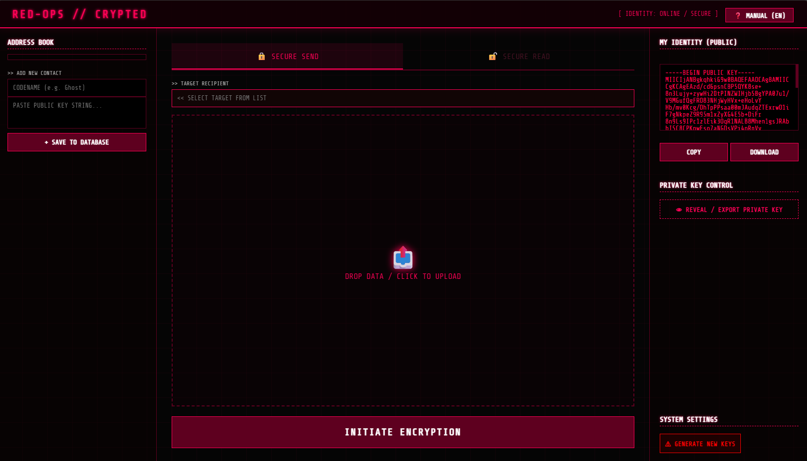

# RED-OPS // ENCRYPTED

RED-OPS is a high-security, browser-based encryption suite designed for secure file exchange using a hybrid RSA-AES architecture. It operates entirely client-side via the Web Crypto API, ensuring that your data and private keys never leave your machine.

## Technical Specifications

This tool implements industry-standard cryptographic primitives to ensure maximum confidentiality and integrity:

* **Asymmetric Encryption:** RSA-OAEP 4096-bit for secure key exchange.
* **Symmetric Encryption:** AES-256-GCM for high-speed file encryption.
* **Integrity Protection:** Galois/Counter Mode (GCM) provides AEAD (Authenticated Encryption with Associated Data), detecting any tampering attempts.
* **Key Derivation:** PBKDF2 with SHA-256 for password-based operations (where applicable).
* **Persistence:** Keys are stored locally in the browser's `localStorage` as JWK (JSON Web Keys).

## Key Features

* **Hybrid Encryption:** Combines the security of RSA with the speed of AES.
* **Identity Management:** Generate, reveal, and export your 4096-bit RSA private and public keys.
* **Local Address Book:** Store contact public keys locally for recurring secure communication.
* **Sender Verification:** Automatically identifies and verifies the sender if their public key is present in your address book.
* **Zero Knowledge:** No server-side processing or data storage. 100% private.

## Operational Procedures

### 1. Identity Setup
Before your first transmission, click **GENERATE NEW KEYS**. This creates your unique 4096-bit RSA Identity. 
* **Public Key:** Share this with contacts so they can encrypt files for you.
* **Private Key:** Keep this secret. Use the **REVEAL** button to backup your key as a `.pem` file.

### 2. Encryption (Secure Send)
1.  Add the recipient's Public Key to the **ADDRESS BOOK**.
2.  Select the contact as your target.
3.  Upload the file in the **SECURE SEND** tab.
4.  Execute **INITIATE ENCRYPTION** and send the resulting `.omega` file to the recipient.

### 3. Decryption (Secure Read)
1.  Navigate to the **SECURE READ** tab.
2.  Upload the encrypted `.omega` file.
3.  The system will attempt to decrypt using your stored Private Key.
4.  If the sender's key is in your address book, the origin will be marked as **VERIFIED**.

## Security Notice

* **Private Key Safety:** Anyone with access to your Private Key can read your messages. Never share it.
* **Browser Storage:** Clearing your browser cache or site data will delete your stored keys. Ensure you have a `.pem` backup.
* **End-to-End Security:** Always verify Public Keys through a secondary, trusted communication channel.

## License

This project is licensed under the MIT License - see the LICENSE file for details.
